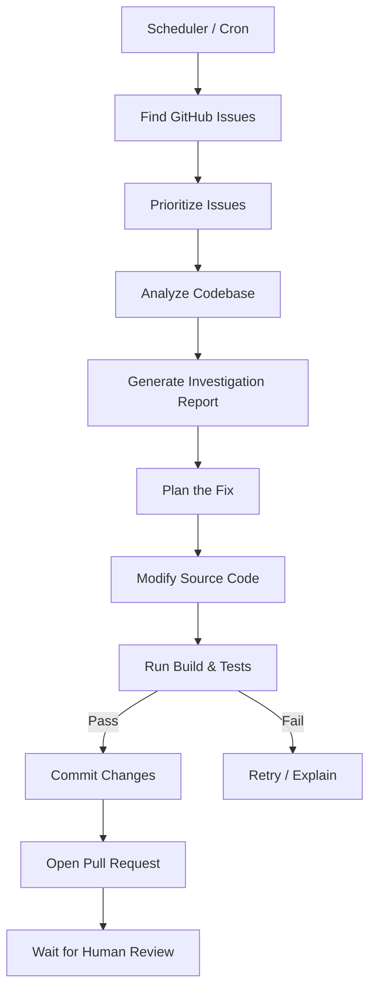
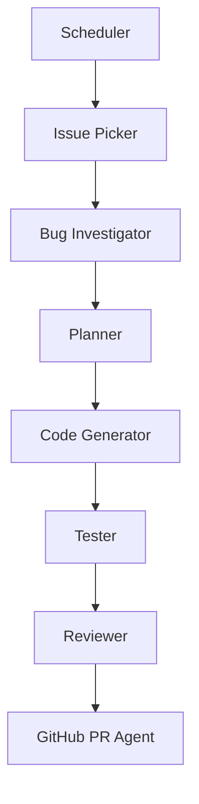
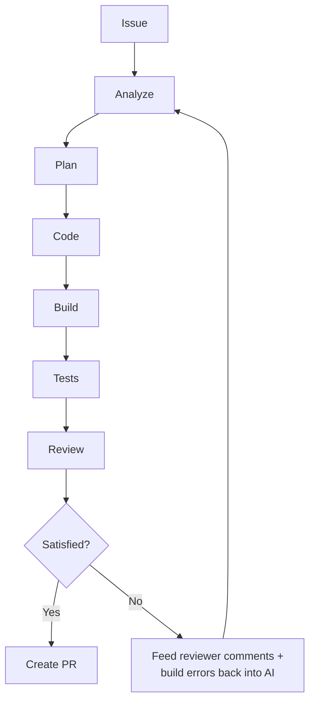

# Proposal: Autonomous Bug-Fixing Engineer (multi-agent .NET architecture)

> **Status: proposal, not adopted.** This is an externally-sourced design for building the
> bug loop as a standalone multi-agent .NET system. It is recorded here for reference and
> comparison against what this repo actually implements — see [`bug-loop.md`](../knowledge/architecture/bug-loop.md)
> for the shipped design. Nothing in this document describes current behaviour.
>
> **Phased delivery plan:** [`bug-loop-roadmap.md`](bug-loop-roadmap.md).

An **Autonomous Bug-Fixing Engineer** that continuously watches a GitHub repository,
analyzes new issues, proposes a solution, implements it, and opens a pull request.

---

## High-level workflow



## Architecture

Instead of one giant AI agent, split it into specialized agents — **each agent has one
responsibility**.



### 1. Scheduler

Runs every hour (or every 10 minutes).

```csharp
while (true)
{
    var issues = github.GetOpenIssues();
    foreach (var issue in issues)
    {
        queue.Enqueue(issue);
    }
    await Task.Delay(TimeSpan.FromHours(1));
}
```

### 2. Issue Picker

Skip issues that are:

- assigned
- in progress
- duplicate
- enhancement
- blocked

Example labels to select on: `bug`, `high-priority`, `good-first-issue`.

Score issues, then pick the highest:

| Signal | Points |
| --- | --- |
| Severity | 40 |
| Recent | 20 |
| Easy | 20 |
| Has stacktrace | 20 |
| **Total** | **100** |

### 3. Investigation Agent

Probably the most important AI agent.

**Input:** GitHub issue · stack trace · logs · source code · architecture docs

**Output:**

```markdown
# Investigation

Symptoms
NullReferenceException occurs when ...

Possible causes
1. UserRepository returns null
2. Missing validation
3. Race condition

Confidence
82%

Files
UserService.cs
OrderService.cs
```

**No coding yet. Only investigation.**

### 4. Planner Agent

Convert the investigation into an implementation plan.

```
Plan
1. Add null validation
2. Add unit test
3. Refactor mapper
4. Update API response
```

### 5. Coding Agent

Now generate the code. It should modify files, create files, and update tests.
**Not open a PR yet.**

### 6. Testing Agent

Runs `dotnet build`, `dotnet test`, lint, and integration tests.

If tests fail, feed the errors back to the AI:

```
Build Error
CS1503
Cannot convert...
```

The AI retries. Repeat 3–5 times.

### 7. Reviewer Agent

Acts like a senior engineer. Checks SOLID, Clean Architecture, naming, complexity,
security, and performance. Produces a report:

```
Review

Good
✓ Added validation

Concern
Repository called twice

Suggestion
Cache result.
```

### 8. GitHub Agent

If everything passes:

```bash
git checkout -b bugfix/145
git add .
git commit
git push
```

Then open a PR:

```
Fix #145

Summary
...
Testing
...
Investigation
...
```

---

## Suggested tech stack

Aimed at a .NET engineer:

| Component | Technology |
| --- | --- |
| Scheduler | .NET Worker Service |
| AI Orchestration | Semantic Kernel or Microsoft Agent Framework |
| GitHub | Octokit.NET |
| Git | LibGit2Sharp or Git CLI |
| Vector Search | PostgreSQL + pgvector, or Qdrant |
| Code Parsing | Roslyn |
| Testing | `dotnet test` |
| Sandbox | Docker containers |
| Queue | RabbitMQ, Kafka, or Azure Service Bus |
| Storage | PostgreSQL |

Roslyn is particularly valuable because it lets the AI inspect and modify C# code using
the syntax tree instead of relying only on text, making changes much safer.

---

## The feedback loop

This is where the "loop engineering" idea becomes powerful.



Every iteration should capture:

- Build errors
- Test failures
- Linter warnings
- Static analysis findings
- Review comments

The next iteration uses these as additional context, gradually improving the solution.

---

## Future enhancements

Once the basic workflow is reliable:

- **Root cause analysis** by tracing call graphs and dependency graphs instead of only
  matching stack traces.
- **Knowledge retrieval** from architecture docs, ADRs, coding standards, and previous
  pull requests using RAG.
- **Automatic reproduction** by generating or running minimal failing tests before making
  changes.
- **Multi-agent collaboration**, where an investigator, coder, tester, and reviewer work
  independently and critique each other's outputs before a final decision.
- **Learning from merged PRs**, so the system adapts to the team's coding style and review
  preferences over time.
- **Risk scoring**, requiring human approval for high-risk changes while allowing low-risk
  fixes (documentation, simple null checks) to progress automatically.

---

## Closing rationale (as proposed)

This architecture aligns well with the kind of AI-assisted engineering systems being built
today: an orchestrator coordinates specialized agents, each operating in a well-defined
stage with feedback loops, deterministic validation (builds/tests), and a mandatory human
review before code is merged. That combination of autonomous execution and guardrails
tends to produce much more reliable results than a single "do everything" AI agent.
