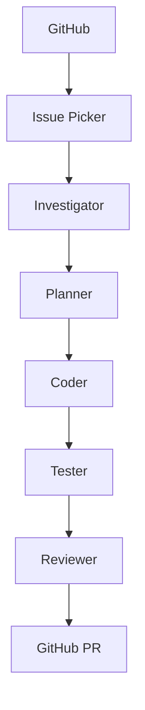
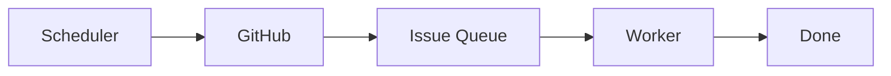
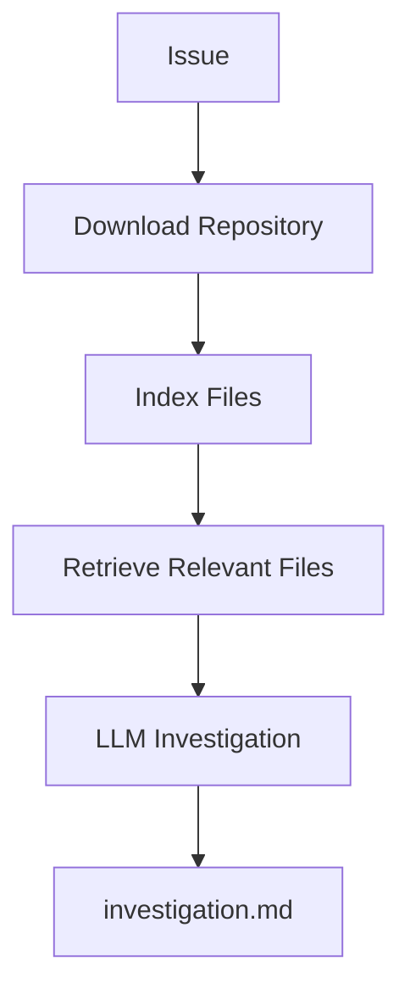
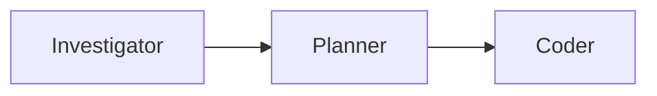
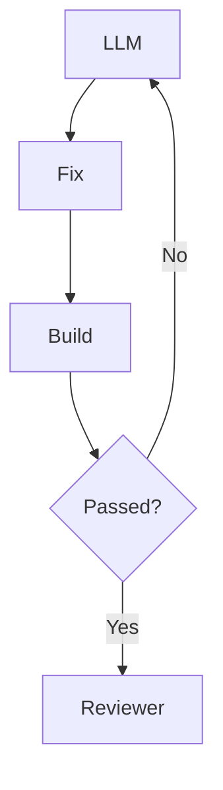
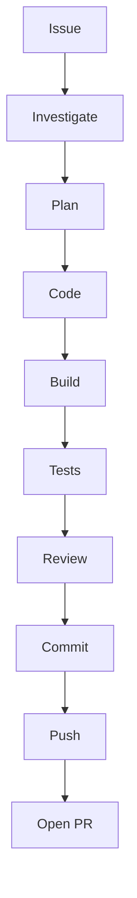
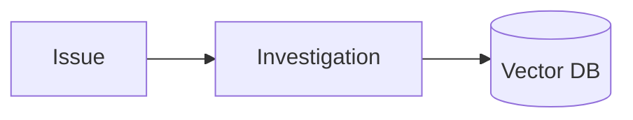

# Roadmap: building an AI Software Engineer

> **Status: Phases 1–5 are shipped and running. Phase 6 onwards is planned.**
>
> This describes **`Loop.Engine`**, a standalone .NET application that acts as an autonomous
> bug-fixing engineer. It is a different artifact from the skills-based bug loop this repo
> also runs — see [`bug-loop.md`](bug-loop.md) for that. Architecture background lives in
> [`bug-loop-proposal.md`](bug-loop-proposal.md).
>
> The two coexist deliberately: the skills loop is the day-to-day baseline, this is the
> deployable product built stage by stage.
>
> Phases 1–5 below are kept as written, including their exit criteria, because the record of
> what each stage was *for* is worth more than a tidy summary. What the first real runs
> exposed is in [Where this landed](#where-this-landed).

## Why this project

It combines almost everything in one deliverable: AI agents, .NET, GitHub APIs, Roslyn,
RAG, event-driven architecture, CI/CD, feedback loops, and software architecture.

More importantly it makes a strong portfolio piece — the kind senior and staff interviewers
enjoy discussing, because it demonstrates architecture, AI orchestration, and engineering
practice rather than just LLM prompting.

**The goal is not a bot. The goal is an AI Software Engineer.**

## The target

At the end of Phase 5, `dotnet run` should produce:

```
✓ Picked Issue #145
✓ Investigating...
✓ Root Cause Found
✓ Generated Fix Plan
✓ Modified 3 files
✓ Tests Passed
✓ Created PR #231
```

## Overall architecture

Every box is an **independent agent** with one responsibility.



## How to work through it

Do **not** try to build the whole system before anything runs. Get a complete vertical
slice working end to end, even if it only handles trivial bugs, then make each stage
smarter. A pipeline that fixes one dumb bug beats six sophisticated agents that have never
run together.

Each phase below has an **exit criterion**. Do not start the next phase until it passes.

---

## Phase 1 — The skeleton

**Forget AI. Build the pipeline.**



**Learn:** GitHub REST API · Octokit · GitHub authentication · Worker Service

**Build the projects:**

- `Loop.Engine`
- `Loop.Engine.Worker`
- `Loop.Engine.Core`
- `Loop.Engine.GitHub`
- `Loop.Engine.Agents`

**Build the model:** `Issue` · `IssueTask` · `AnalysisResult` · `FixPlan` · `PullRequestContext`

**Deliverable** — the scheduler finds issues and prints them. Nothing else:

```
Found Issue #132
Title      NullReferenceException
Assigned   No
Ready for investigation
```

**Exit criterion:** the worker runs on a timer, authenticates to GitHub, and prints open
issues without crashing. No AI involved anywhere.

---

## Phase 2 — The Investigation Agent

**Today AI starts.** Instead of asking the model *"fix this bug"*, ask it *"investigate
this bug"*. That single change dramatically improves quality — and it is the whole point
of separating investigation from coding.



**Learn:** Semantic Kernel (or Microsoft Agent Framework) · GitHub file search ·
Roslyn syntax-tree basics · embeddings and RAG (optional, if time permits)

**Report contains:** symptoms · possible root cause · affected classes · confidence ·
recommended investigation

**No code generation. Only analysis.**

**Exit criterion:** given an issue number, the system emits an `investigation.md` naming
the actual files involved — verified by you reading it, not by the model asserting it.

---

## Phase 3 — Planner + Coder

**Split thinking from coding.**



The **Planner** turns the investigation into discrete tasks:

```
Task 1  Add validation
Task 2  Add test
Task 3  Update mapper
```

The **Coder** receives the issue, the report, the plan, and the relevant files — then
modifies code.

> **Do not let the coding agent explore the whole repository.** Give it only the files the
> investigation identified. An agent with the run of the repo will find something to change
> whether or not it is the bug.

**Learn:** Roslyn · AST · function extraction · git diff generation

**Exit criterion:** the pipeline produces a git diff that compiles. Correctness is not yet
required — that is Phase 4's job.

---

## Phase 4 — The feedback loop

**Today the project becomes much smarter.** This is the phase that separates a demo from a
tool.

After code generation, run `dotnet build` and `dotnet test`, collect compiler errors,
warnings, and test failures, and feed them back.



**Maximum 5 attempts**, then stop and explain. This is exactly how modern coding agents
work — and the attempt cap is what keeps it from grinding forever on a bug it cannot solve.

### Also add the Reviewer Agent

**The reviewer never edits code.** It reads the diff and produces suggestions across
security, performance, naming, architecture, and clean code. Separating the critic from the
author is what makes the critique worth reading.

**Exit criterion:** a deliberately broken build recovers on its own within 5 attempts, and
the reviewer produces a report on the resulting diff.

---

## Phase 5 — GitHub automation

**Connect everything.** The full pipeline runs end to end and lands a PR.



Automate `git checkout`, `git add`, `git commit`, `git push`, and PR creation.

**PR template:** Summary · Root Cause · Changes · Testing · Risk · Reviewer Notes

**Exit criterion:** `dotnet run` takes a real issue to an open PR with no human keystrokes
— and a human still merges it.

---

## Where this landed

Phases 1–5 shipped. Issue **#8** — a real defect, left deliberately unfixed — was the ruler
each phase was measured against.

| Phase | Exit criterion | Result | Landed in |
| --- | --- | --- | --- |
| 1 | Skeleton runs, reads issues | ✅ | PR #9 |
| 2 | Investigation names the right files | ✅ 3/3 correct on #8 | PR #9 |
| 3 | Planner + Coder produce a valid diff | ✅ | PR #10 |
| 4 | A broken build recovers on its own | ✅ caught and diagnosed correctly | PR #10 |
| 5 | Issue → open PR, no keystrokes | ✅ **PR #13** — one file, `+6/-3` | PR #11 |
| — | One worktree for every stage | ✅ | pushed straight to `main` |

The PR titles do not match their contents: `feat: phase 3` (#10) also carried Phase 4, and
`fix: fix the worktree` (#11) carried all of Phase 5. The worktree restructure never got a PR
at all. Worth knowing before trusting the git history to explain itself.

The pipeline works end to end. The items below are not polish — they are things the first
real runs proved wrong, and each has direct evidence.

---

## Phase 6 — Fix what the first runs exposed

Two defects, both small, both live. Neither is a feature request.

### 6.1 The loop does not check that an issue is a bug

`bug-loop`'s stated invariant is **bugs only**. `Loop.Engine` does not enforce it:

```csharp
var request = new RepositoryIssueRequest { State = ItemStateFilter.Open };  // every issue
...
return issues.OrderBy(i => i.Number).FirstOrDefault();                      // oldest wins
```

`Issue.Labels` is populated and then never read. Running with default config today would
select **#1 ("Add dark mode toggle")** — a feature request — and attempt to fix it as a bug.
This stayed hidden only because every run so far pinned `Pipeline:IssueNumber = 8`.

Filter on the `bug` label in `GitHubIssueSource`, and make `SelectTarget` refuse an
explicitly requested issue that lacks it. Refuse loudly, like every other guard here:
silently investigating the wrong issue looks exactly like success.

**Exit criterion:** with no `IssueNumber` set and only a feature issue open, the tick reports
that it found no bug and does nothing.

### 6.2 The Reviewer is generated, then ignored

`ReviewerAgent` assigns a `Severity` to every finding. The pipeline reads none of it:

```csharp
Console.WriteLine($"Review for #{issue.Number} -> {reviewPath} ({review.Findings.Count} finding(s))");
// publishes regardless
```

A `critical` finding opens a PR on exactly the same terms as a clean review. Paying a model
to produce a judgement and then discarding it is worse than not asking.

Do **not** block publishing — a flagged PR is still more useful than no PR. Label it
`needs-human` and put the findings at the top of the body, where a reviewer sees them before
the diff.

**Exit criterion:** a PR whose review contains a high-severity finding is labelled and
carries the warning above the diff.

---

## Phase 7 — Make it measurable

One line in the entire codebase touches `Usage`, in `InvestigationAgent`, and only on
failure. So these questions currently have no answer:

- What does one issue cost?
- Which stage burns the most tokens?
- How many repair attempts does a typical fix take?
- What fraction of ticks reach an open PR?

For a system that runs unattended, that is the largest operational gap. It also blocks
Phase 8: without a baseline, "the fix is better now" is an opinion.

A `RunMetrics` record accumulating tokens, wall time, and attempts per stage, appended to
`review-<n>.md`, is enough. Tens of lines, not a sprint.

**Exit criterion:** every run ends with a per-stage cost and duration breakdown.

---

## Phase 8 — Prove the fix, don't just survive it

The real gap between the two loops.

`fix-bug-issue` invokes the **`tdd`** skill: a failing test that reproduces the defect comes
first, then the fix turns it green. `Loop.Engine` only runs the tests that already existed —
which is why its PR body has to admit:

> **No test reproduces the original defect.** The suite proves this change breaks nothing;
> it does not prove the reported bug is fixed.

That sentence is honest, and it is also the ceiling on how much a human can trust the output.

Make `PlannerAgent` produce a failing test first. Have `FixVerifier` confirm it fails *for
the expected reason* — a test that fails because it does not compile proves nothing — and
only then let `CoderAgent` run. The red→green transition becomes the evidence.

**Exit criterion:** a PR contains a test that fails on `main` and passes on the branch, and
the PR body can drop its disclaimer.

---

## Phase 9 — Quality of generated code

PR #13 showed the Coder's habits: filler comments (`// Set the application root`), a
stripped trailing newline, and a log line describing the resolution path it had just
replaced.

Cheapest fix by far: run `dotnet format --verify-no-changes` inside `FixVerifier` and treat a
formatting failure like a build failure. The compiler is already the referee; sit the
formatter in the same chair. Anything checkable by a tool should never be asked of a model.

**Exit criterion:** generated diffs pass `dotnet format` without human cleanup.

---

## Beyond the first sprint

Speculative until Phases 6–9 hold. Each of these is a sprint, not an afternoon — and none of
them is worth starting while the loop still cannot tell a bug from a feature request.

### 1. Memory

Store every investigation so future bugs can reuse similar fixes.



### 2. Root cause database

Instead of fixing a `NullReferenceException` in isolation, store **pattern → typical fix →
confidence**. This is where the system starts learning from experience.

### 3. Multi-agent collaboration

Investigator · Planner · Coder · Reviewer · Architect — each with a different system prompt
and responsibility, critiquing each other's output before a final decision.

### 4. Confidence score

Gate PR creation on confidence. Below 70% → human approval required.

### 5. Slack notification

`Issue Picked → Working → PR Ready`.

### Sprint roadmap

| Sprint | Focus | Status |
| --- | --- | --- |
| **1** (Phases 1–5) | A working autonomous pipeline from GitHub issue to pull request | ✅ shipped |
| **2** (Phases 6–7) | Correctness and observability: bug-only selection, review gating, cost metrics | planned |
| **3** (Phase 8) | Prove the fix: failing test first, red→green as evidence | planned |
| **4** (Phase 9 +) | Production readiness: formatting gate, Docker sandboxing, confidence scoring, multi-repo | planned |

Phases 6 and 7 are deliberately first. They are the smallest items on this list and the only
ones backed by a defect that exists today.

---

## Deliberately not doing

Recording these matters as much as the plan, because each looks like an obvious improvement
and each would undo something that was paid for.

- **Concurrent issues.** One bug at a time is a decision, not a limitation. Parallel branches
  racing each other only make the first failures harder to read — and reading failures is
  still the bottleneck.
- **Raising `MaxAttempts` above 5.** Lifting the cap to get past a stubborn bug trades a
  bounded failure for an unbounded one.
- **Letting the loop merge.** The strongest guarantee in the design is structural: neither
  publisher interface has a merge, approve, or close method. A model cannot call what does
  not exist. Do not add it.
- **Merging the two loops.** The skills loop is what gets used daily; `Loop.Engine` is what
  can be deployed. Different jobs.
- **Letting the model choose which files to read.** `SymbolExtractor` and `FileRetriever`
  score candidates with fixed rules (filename 100, content 1) precisely so retrieval stays
  testable and reproducible.
- **A second source of truth about the working tree.** Every stage shares one worktree
  created from the base branch. Two trees disagreed twice in this project's history: once a
  fix arrived as a 24-file PR, once the repair loop deleted working code the compiler could
  not see and reported success throughout.

---

## Technology choices

| Layer | Recommendation |
| --- | --- |
| Language | C# (.NET 9 or latest stable) |
| AI SDK | Semantic Kernel (easy to start) or Microsoft Agent Framework (richer multi-agent workflows) |
| GitHub | Octokit.NET |
| Parsing | Roslyn |
| Vector search | PostgreSQL + pgvector |
| Scheduler | .NET Worker Service |
| Git | LibGit2Sharp or Git CLI |
| Build | `dotnet build` |
| Tests | `dotnet test` |
| Logs | OpenTelemetry + Aspire Dashboard |
| LLM | A strong reasoning model, with a cheaper model for routine tasks if cost matters |

---

## Mentoring note

Treat this as the **first sprint of a larger project**, not a five-day sprint to a finished
product. The value is in the vertical slice: one complete path from issue to PR that
actually runs. Every stage can be made smarter afterwards, and none of them can be made
smarter before the loop closes.

This has the potential to be a portfolio centrepiece because it demonstrates system
architecture, AI orchestration, software engineering, and practical automation — not just
LLM integration. Given a background in .NET, microservices, AWS, CQRS, and event-driven
systems, it is a natural extension of skills already in place.
