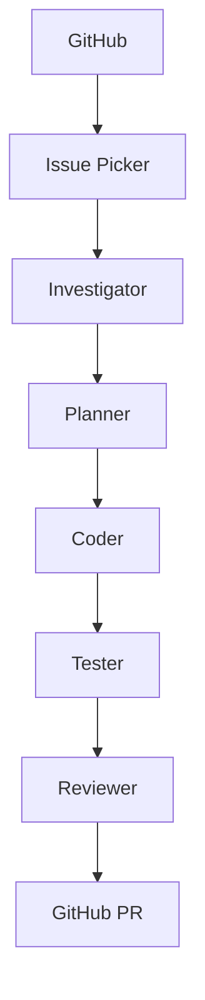
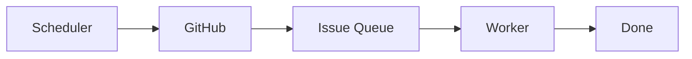
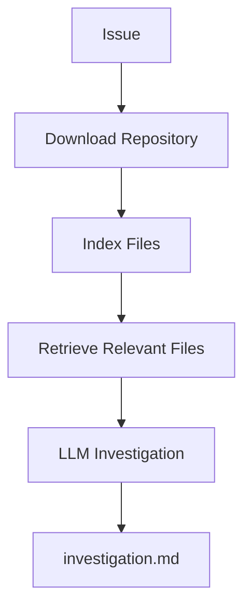
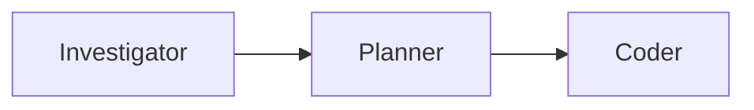
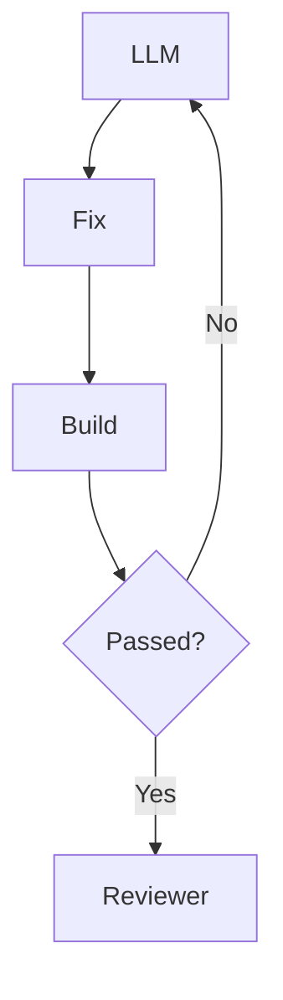
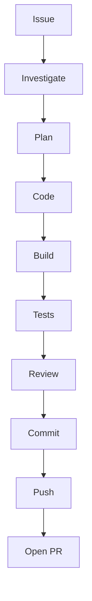
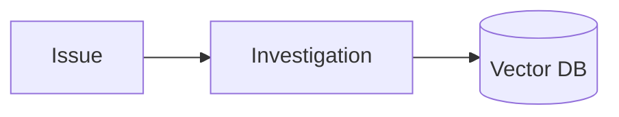

# Roadmap: building an AI Software Engineer

> **Status: roadmap for a proposed product, not a description of this repo.**
>
> This plans a **standalone .NET application** (`Loop.Engine`) that acts as an autonomous
> bug-fixing engineer. It is a different artifact from the skills-based bug loop this repo
> already runs — see [`bug-loop.md`](bug-loop.md) for that. Architecture background lives
> in [`bug-loop-proposal.md`](bug-loop-proposal.md).
>
> The two can coexist: the shipped loop is the working baseline, this is the product built
> deliberately, stage by stage.

## Why this project

It combines almost everything in one deliverable: AI agents, .NET, GitHub APIs, Roslyn,
RAG, event-driven architecture, CI/CD, feedback loops, and software architecture.

More importantly it makes a strong portfolio piece — the kind senior and staff interviewers
enjoy discussing, because it demonstrates architecture, AI orchestration, and engineering
practice rather than just LLM prompting.

**The goal is not a bot. The goal is an AI Software Engineer.**

## The target

At the end of Phase 5, `dotnet run` should produce:

```
✓ Picked Issue #145
✓ Investigating...
✓ Root Cause Found
✓ Generated Fix Plan
✓ Modified 3 files
✓ Tests Passed
✓ Created PR #231
```

## Overall architecture

Every box is an **independent agent** with one responsibility.



## How to work through it

Do **not** try to build the whole system before anything runs. Get a complete vertical
slice working end to end, even if it only handles trivial bugs, then make each stage
smarter. A pipeline that fixes one dumb bug beats six sophisticated agents that have never
run together.

Each phase below has an **exit criterion**. Do not start the next phase until it passes.

---

## Phase 1 — The skeleton

**Forget AI. Build the pipeline.**



**Learn:** GitHub REST API · Octokit · GitHub authentication · Worker Service

**Build the projects:**

- `Loop.Engine`
- `Loop.Engine.Worker`
- `Loop.Engine.Core`
- `Loop.Engine.GitHub`
- `Loop.Engine.Agents`

**Build the model:** `Issue` · `IssueTask` · `AnalysisResult` · `FixPlan` · `PullRequestContext`

**Deliverable** — the scheduler finds issues and prints them. Nothing else:

```
Found Issue #132
Title      NullReferenceException
Assigned   No
Ready for investigation
```

**Exit criterion:** the worker runs on a timer, authenticates to GitHub, and prints open
issues without crashing. No AI involved anywhere.

---

## Phase 2 — The Investigation Agent

**Today AI starts.** Instead of asking the model *"fix this bug"*, ask it *"investigate
this bug"*. That single change dramatically improves quality — and it is the whole point
of separating investigation from coding.



**Learn:** Semantic Kernel (or Microsoft Agent Framework) · GitHub file search ·
Roslyn syntax-tree basics · embeddings and RAG (optional, if time permits)

**Report contains:** symptoms · possible root cause · affected classes · confidence ·
recommended investigation

**No code generation. Only analysis.**

**Exit criterion:** given an issue number, the system emits an `investigation.md` naming
the actual files involved — verified by you reading it, not by the model asserting it.

---

## Phase 3 — Planner + Coder

**Split thinking from coding.**



The **Planner** turns the investigation into discrete tasks:

```
Task 1  Add validation
Task 2  Add test
Task 3  Update mapper
```

The **Coder** receives the issue, the report, the plan, and the relevant files — then
modifies code.

> **Do not let the coding agent explore the whole repository.** Give it only the files the
> investigation identified. An agent with the run of the repo will find something to change
> whether or not it is the bug.

**Learn:** Roslyn · AST · function extraction · git diff generation

**Exit criterion:** the pipeline produces a git diff that compiles. Correctness is not yet
required — that is Phase 4's job.

---

## Phase 4 — The feedback loop

**Today the project becomes much smarter.** This is the phase that separates a demo from a
tool.

After code generation, run `dotnet build` and `dotnet test`, collect compiler errors,
warnings, and test failures, and feed them back.



**Maximum 5 attempts**, then stop and explain. This is exactly how modern coding agents
work — and the attempt cap is what keeps it from grinding forever on a bug it cannot solve.

### Also add the Reviewer Agent

**The reviewer never edits code.** It reads the diff and produces suggestions across
security, performance, naming, architecture, and clean code. Separating the critic from the
author is what makes the critique worth reading.

**Exit criterion:** a deliberately broken build recovers on its own within 5 attempts, and
the reviewer produces a report on the resulting diff.

---

## Phase 5 — GitHub automation

**Connect everything.** The full pipeline runs end to end and lands a PR.



Automate `git checkout`, `git add`, `git commit`, `git push`, and PR creation.

**PR template:** Summary · Root Cause · Changes · Testing · Risk · Reviewer Notes

**Exit criterion:** `dotnet run` takes a real issue to an open PR with no human keystrokes
— and a human still merges it.

---

## Beyond the first sprint

Once the core loop is reliable, extend it. Each of these is a sprint, not an afternoon.

### 1. Memory

Store every investigation so future bugs can reuse similar fixes.



### 2. Root cause database

Instead of fixing a `NullReferenceException` in isolation, store **pattern → typical fix →
confidence**. This is where the system starts learning from experience.

### 3. Multi-agent collaboration

Investigator · Planner · Coder · Reviewer · Architect — each with a different system prompt
and responsibility, critiquing each other's output before a final decision.

### 4. Confidence score

Gate PR creation on confidence. Below 70% → human approval required.

### 5. Slack notification

`Issue Picked → Working → PR Ready`.

### Sprint roadmap

| Sprint | Focus |
| --- | --- |
| **1** (Phases 1–5) | A working autonomous pipeline from GitHub issue to pull request |
| **2** | Better investigation: Roslyn-based code understanding and RAG |
| **3** | Multi-agent collaboration and self-critique |
| **4** | Production readiness: Docker sandboxing, observability, metrics, confidence scoring, multi-repo support |

---

## Technology choices

| Layer | Recommendation |
| --- | --- |
| Language | C# (.NET 9 or latest stable) |
| AI SDK | Semantic Kernel (easy to start) or Microsoft Agent Framework (richer multi-agent workflows) |
| GitHub | Octokit.NET |
| Parsing | Roslyn |
| Vector search | PostgreSQL + pgvector |
| Scheduler | .NET Worker Service |
| Git | LibGit2Sharp or Git CLI |
| Build | `dotnet build` |
| Tests | `dotnet test` |
| Logs | OpenTelemetry + Aspire Dashboard |
| LLM | A strong reasoning model, with a cheaper model for routine tasks if cost matters |

---

## Mentoring note

Treat this as the **first sprint of a larger project**, not a five-day sprint to a finished
product. The value is in the vertical slice: one complete path from issue to PR that
actually runs. Every stage can be made smarter afterwards, and none of them can be made
smarter before the loop closes.

This has the potential to be a portfolio centrepiece because it demonstrates system
architecture, AI orchestration, software engineering, and practical automation — not just
LLM integration. Given a background in .NET, microservices, AWS, CQRS, and event-driven
systems, it is a natural extension of skills already in place.
